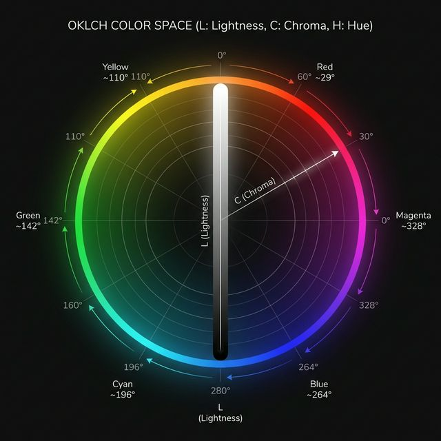

# OKLCH Grade — Nuke BlinkScript Gizmo

> Perceptually uniform color grading for Nuke, built on the [Oklab color space](https://en.wikipedia.org/wiki/Oklab_color_space).

---

## Why OKLCH?

Most color spaces you work in every day — HSL, HSV, even CIE Lab — have a fundamental problem: their axes don't match how human vision actually works. Crank the saturation in HSL and yellows blow up while blues barely move. Slide the lightness and your hue shifts. The numbers change uniformly; the image doesn't look like it.

**OKLCH fixes this.** It's a polar form of [Oklab](https://en.wikipedia.org/wiki/Oklab_color_space), a color space designed by [Björn Ottosson](https://bottosson.github.io/posts/oklab/) specifically to be *perceptually uniform* — meaning equal steps in the math produce equal steps in what you see.

<p align="center">
  
</p>

### The three axes, explained

| Axis | Range | What it actually controls |
|------|-------|--------------------------|
| **L** — Lightness | 0 → 1 | Perceived brightness, independent of hue |
| **C** — Chroma | 0 → ~0.4+ | Colorfulness / intensity, without saturation drift |
| **H** — Hue | 0° → 360° | The color itself, as a perceptually spaced angle |

The key insight: in OKLCH, **L is truly independent of C and H**. Adjust lightness and your colors don't shift hue. Adjust chroma and brightness stays locked. This is something HSL and HSV simply cannot do.

### How it compares

| | RGB / HSL | CIE Lab / LCH | **OKLCH** |
|---|---|---|---|
| Perceptually uniform | ✗ | Partially | ✓ |
| Hue-stable lightness | ✗ | Partially | ✓ |
| Clean gradients | ✗ | ✓ | ✓ |
| No hue drift on saturation | ✗ | Partially | ✓ |
| Designed for modern HDR/wide gamut | ✗ | ✗ | ✓ |

For a deep dive into the color space and an interactive explorer, see [oklch.fyi](https://oklch.fyi/) — it's the best way to build an intuition for how the axes behave.

---

## What this gizmo does

`OKLCH_Grade` is a BlinkScript-powered Nuke gizmo that converts your image *into* OKLCH space, applies grading operations there, then converts back — all within a single node, with full OCIO colorspace awareness on input and output.

Because the grade happens in OKLCH space:

- **Lift/gamma/gain on Lightness doesn't shift hue or chroma**
- **Chroma adjustments don't blow out or crush specific hues**
- **Hue rotations are perceptually even across the spectrum**
- **Targeted hue controls work on the hue angle you actually see**

---

## Repository Structure

```
oklch_nuke/
├── src/
│   ├── blink/
│   │   └── oklch_grade_kernel.cpp        # BlinkScript kernel (linear-sRGB ↔ OKLab/OKLCH)
│   └── gizmos/
│       ├── OKLCH_Grade.gizmo             # Nuke gizmo with OCIO IO and grade controls
│       ├── oklch_grade_callbacks.py      # onCreate / knobChanged callback module
│       └── icons/
│           └── oklch_grade.png
├── tools/
│   └── oklch_grade_init.py               # Archived authoring helper (not used at runtime)
├── research/
│   └── colorpicker_hue_target_investigation.md
├── tests/
│   └── oklch_reference_test_vectors.md
└── docs/
    └── oklch_colorspace_diagram.png
```

### Node architecture

```
Input → OCIOColorSpace_IN (→ linear-sRGB) → BlinkScript_OKLCHGrade → OCIOColorSpace_OUT (→ output space) → Output
```

---

## Controls

### Input / Output

| Knob | Description |
|------|-------------|
| `input_colorspace` | Source OCIO colorspace for the incoming image |
| `output_colorspace` | Target OCIO colorspace for the output |

### Lightness

| Knob | Description |
|------|-------------|
| `l_gain` | Multiply lightness |
| `l_offset` | Add/subtract from lightness |
| `l_contrast` | Contrast around a pivot |
| `l_pivot` | Lightness value used as the contrast pivot point |

### Chroma

| Knob | Description |
|------|-------------|
| `c_gain` | Scale chroma (colorfulness) |
| `c_offset` | Shift chroma globally |

### Hue

| Knob | Description |
|------|-------------|
| `hue_shift_deg` | Global hue rotation (degrees) |
| `hue_chroma_threshold` | Minimum chroma below which hue controls have no effect |
| `hue_shift_red/yellow/green/cyan/blue/magenta` | Per-channel hue pushes |
| `hue_target_deg` | Center hue angle for targeted adjustment |
| `hue_target_shift` | Amount to shift the targeted hue band |
| `hue_target_falloff_deg` | Width of the targeted hue band |

### Utility

| Knob | Description |
|------|-------------|
| `mix` | Blend between graded and original |
| `clamp_output` | Clamp output to 0–1 |
| `bypass` | Pass input through untouched |

---

## Installation

### Option A: `init.py` (Recommended)

1. Clone this repository:

   ```bash
   git clone https://github.com/georgeantonopoulos/oklch_nuke.git
   ```

2. Add to your `~/.nuke/init.py`:

   ```python
   nuke.pluginAddPath('/path/to/oklch_nuke')
   ```

3. Restart Nuke.

### Option B: `NUKE_PATH` Environment Variable

```bash
# macOS / Linux
export NUKE_PATH="/path/to/oklch_nuke:$NUKE_PATH"

# Windows
set NUKE_PATH=C:\path\to\oklch_nuke;%NUKE_PATH%
```

Restart Nuke after setting the variable.

### Verification

After restarting, find the node at:

```
Nodes > Color > OKLCH > OKLCH Grade
```

Or press **Tab** and type `OKLCH_Grade`.

To verify programmatically in the Nuke Script Editor:

```python
import nuke
print("Plugin paths:", nuke.pluginPath())
try:
    node = nuke.createNode("OKLCH_Grade", inpanel=False)
    print("OKLCH_Grade creation: OK")
    nuke.delete(node)
except Exception as exc:
    print("OKLCH_Grade creation failed:", exc)
```

---

## Validation

Reference test vectors live in `tests/oklch_reference_test_vectors.md`. They cover:

- Identity round-trip epsilon (`≤ 1e-5`)
- Achromatic hue stability
- Hue wrap at 0°/360°
- Unclamped vs clamped output policy
- Alpha passthrough
- OCIO fallback when no linear-sRGB alias exists

---

## References

- [Oklab color space — Wikipedia](https://en.wikipedia.org/wiki/Oklab_color_space) — the mathematical foundation and motivation behind Oklab
- [oklch.fyi](https://oklch.fyi/) — interactive OKLCH color picker, converter, and explainer
- [Björn Ottosson — A perceptual color space for image processing](https://bottosson.github.io/posts/oklab/) — the original Oklab derivation
- `research/` — internal notes on Blink syntax, OCIO wiring, and OKLCH math constants
